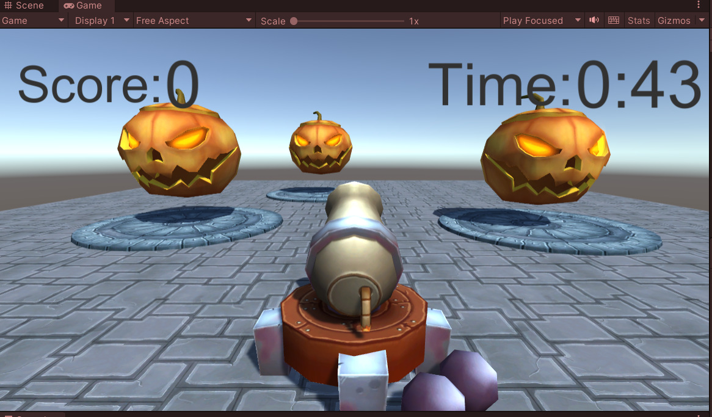
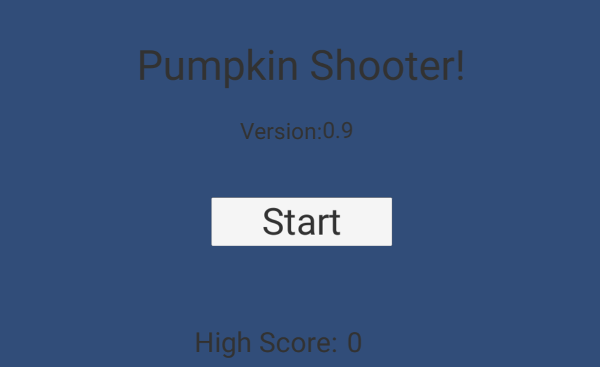
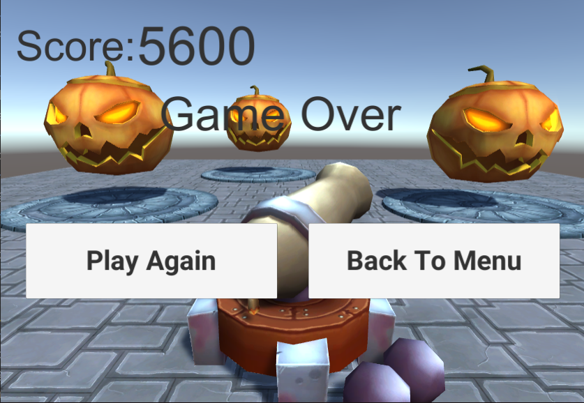

# Halloween Shooter

This is a Tutorial Unity game project desinged to teach:

- Singleton design pattern for game manager.
- Object Pool design pattern for balls.
- Save/load game data using json files
- Save/load user score in persistent way

# Project Description

Create a shooter game in which the player shoots a pumpkins with a cannon. The gameplay is timed and the player scores by shooting a pumpkin successfully. The following shows the scene you should recreate:

 

## Main Architectural Guide

- Data I/O: The project needs to become data driven. Create and read data from human readable file or files ( JSON, txt, etc) you create. All information you deem relevant that could be changed by a designer or come from a server should live in
these file(s). Create two classes to save/loade the json file:
  - **Config** class: A singleton class that uses ConfigData class to de/serialize the game data from/into a json file.
  - **ConfigData** class that holds the data to be serialized.
- Start Menu: The following fields are filled in from data read in from a json file in the project:
  - Pumpkin type to spawn (PumpkinTypeSpawn)
  - Game Title
  - Game Version
  - Time left during gameplay (GameSessionLenghtInSec)

- High score is tracked between sessions locally (Using PlayerPref)

Game Scene:

- The pumpkin prefabs spawn at the spawn points already located in the scene. When a pumpkin is shot a new one is spawn.
- Shooting a pumpkin causes the score to increase and that the high score UI is functioning properly.
- What pumpkins spawn, the game session length and some other gameplay related variables come from the text file.
- There is no spawned object left in the scene past their usefulness (they either get destroyed or released back into the object pool.)
- Game over screen buttons functions as expected:
- 

- **Polish Task**: Add looping game music. It should continue playing uninterrupted while the game scene loads, while the game is running and when the player transitions back to the menu. To acheive that, create a singleton class "MusicManager" and attached it to a gameObject that persist through different scenes.
- **Optimizations**
  1. Use object pooling for instead of cannonballs instantiation to increase performance. (bonus point: create objects gradually using a coroutine.)
  2. Update UI in game scene (HUD.cs) using coroutines every second instead of being updated every frame in the Update() method.
